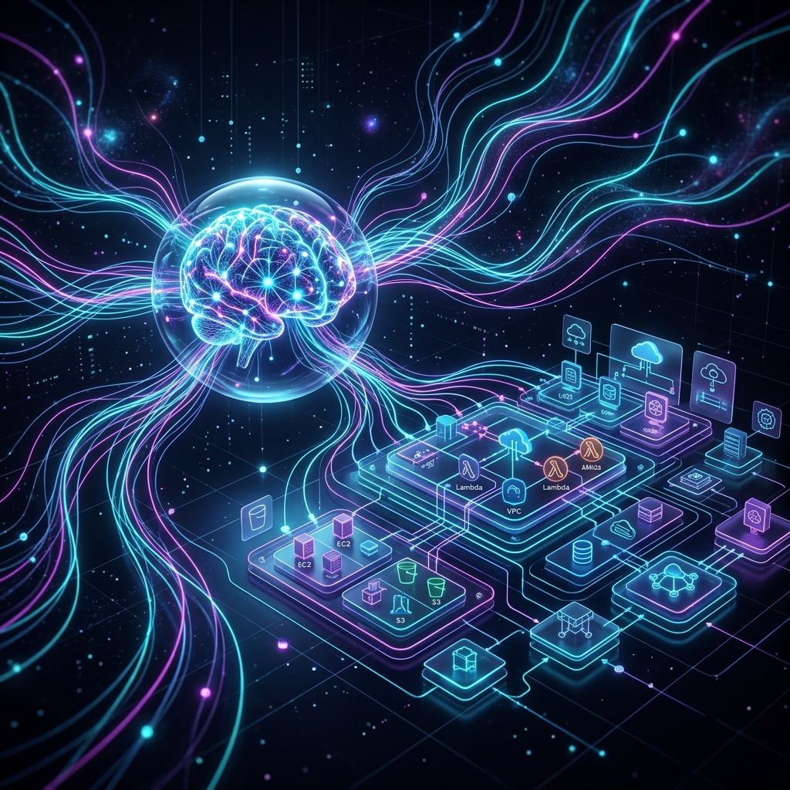

# Serverless Claw

<p align="center">
  
</p>

<p align="center">
  
  
  
  
  
  
  
  
  
  
</p>

<p align="center">
  <font size="6"><strong>The Self-Evolving AI Agent Swarm</strong></font><br>
  <em>$0 when idle. Elastic by design. Secure by default.</em>
</p>

---

### 💎 The 3 Pillars of Serverless Claw

| 🚀 **Infinite Scale** | 🧠 **Self-Evolution** | 🛡️ **Cloud-Native Safety** |
| :--- | :--- | :--- |
| **$0 when idle.** Lambda scales to zero. No VPS, no Docker daemon, no 24/7 server costs. | **Council-Verified.** Agents write code, run tests, and redeploy the stack via a peer-reviewed loop. | **Zero Trust.** No SSH keys, no persistent daemons. IAM least-privilege and DMS rollback. |

---

## Why Serverless for AI?

In 2026, **the 24/7 VPS mascot is dead.** Running agent swarms on persistent pods is an expensive relic of the container era.

- **Cost Efficient**: You pay exactly for the tokens and compute you use. A complex reasoning task might cost $0.05; staying idle costs **$0**.
- **Instantly Elastic**: Need 1,000 agents to research a topic in parallel? Serverless Claw fans out across AWS Lambda instantly.
- **Maintenance Free**: No Docker security patches, no OS updates, no resource exhaustion. Just pure intelligence.

---

## Council-Verified Evolution

Serverless Claw doesn't just execute code; it **improves itself**. But unlike raw autonomous systems, every evolution is gated by a **Council of Agents**.

```text
  [ Cognition Reflector ] ───▶ [ Strategic Planner ]
                                        │
                                        ▼
  [ Coder Agent ] ◀─────── [ Council of Agents ] (Safety Gate)
        │
        ▼
  [ Deployer (CodeBuild) ] ──▶ [ Build Monitor ] ──▶ [ QA Auditor ] ──▶ [ DONE ]
```

---

## How It Works

```text
You (Messenger)        SuperClaw (Lambda)       AgentBus (EB)       Specialized Agents (x8)
      │                       │                      │                       │
      └─▶ "Feature X" ────────▶ [THINK: Strategic] ──▶ DISPATCH_TASK ────────▶ [EXECUTE]
                              │                      │                       │
      ◀─▶ Real-time Dashboard ◀─ [ASYNC: Pause] ◀──── [BUS ROUTING] ◀────────┤
                              │                                              │
      ◀─────────────────────── [IOT CORE / MQTT] ◀── [SIGNAL_ORCH] ◀─────────┘
```

When you send a message, **SuperClaw** receives it, develops a plan with the **Strategic Planner**, and dispatches tasks to specialized nodes via **EventBridge**. The system implements an **Asynchronous "Pause & Resume"** pattern — agents don't block; they emit a task and terminate, waking up only when a result signal is routed back. High-impact plans are peer-reviewed by the **Council of Agents**, while the **Facilitator** moderates collaborative sessions to drive consensus.

## 🤖 The Multi-Agent Ecosystem

| Agent | Responsibilities |
| :--- | :--- |
| **SuperClaw** | Orchestrator. Interprets intent, delegates tasks, and deploys. |
| **Strategic Planner** | Designs long-term evolution and expansion plans. |
| **Coder Agent** | Writes code, fixes bugs, and performs migrations. |
| **QA Auditor** | Verifies the technical satisfaction of every deployment. |
| **Facilitator** | Moderates collaboration between multiple agents and humans. |
| **Cognition Reflector** | Distills memory and identifies system-wide gaps. |
| **Critic Agents** | Peer-reviewers for Security, Performance, and Architecture. |

---

## ⚡️ Quick Start (AWS-Native)

Deploy your first autonomous swarm in 5 minutes.

### 1. Zero-Install Deploy

```bash
git clone https://github.com/caopengau/serverlessclaw.git
cd serverlessclaw && pnpm install
```

### 2. Secure Your Keys

```bash
cp .env.example .env
# Essential: SST_SECRET_OpenAIApiKey & SST_SECRET_TelegramBotToken
```

### 3. Launch Local Dev

```bash
make dev # Live lambda reloading, local DynamoDB, and real-time logs
```

### 4. Deploy to AWS

```bash
make deploy ENV=dev # High-availability, production-grade infrastructure
```

## Documentation Hub

Start with **[INDEX.md](./INDEX.md)** — the progressive context loading map for both humans and agents.

| Doc                                  | Purpose                                        |
| ------------------------------------ | ---------------------------------------------- |
| [INDEX.md](./INDEX.md)               | **Hub** — Start here for the documentation map |
| [ARCHITECTURE.md](./ARCHITECTURE.md) | System topology & **AI-Native Principles**     |
| [docs/AGENTS.md](./docs/AGENTS.md)   | Agent roster & Evolutionary loop               |
| [docs/MEMORY.md](./docs/MEMORY.md)   | Tiered memory engine & co-management           |
| [docs/TOOLS.md](./docs/TOOLS.md)     | Full tool registry & **MCP Standards**         |
| [docs/SAFETY.md](./docs/SAFETY.md)   | Circuit breakers & DMS Rollback                |
| [docs/DEVOPS.md](./docs/DEVOPS.md)   | DevOps Hub, make targets, & CI/CD              |
| [docs/ROADMAP.md](./docs/ROADMAP.md) | Planned features & Strategic goals             |

## 🆚 The 2026 "Claw" Comparison

| Feature                  | **OpenClaw**          | **NanoClaw**          | **ZeroClaw**          | **Serverless Claw (Us)**                 |
| :----------------------- | :-------------------- | :-------------------- | :-------------------- | :--------------------------------------- |
| _Infrastructure_         |                       |                       |                       |                                          |
| **Architecture**         | Monolithic Node.js    | Micro TypeScript      | Native Rust Binary    | **Event-Driven Serverless (Lambda)**     |
| **Operational Cost**     | High (24/7 Server)    | Moderate (VPS/Docker) | Low (Raspberry Pi)    | **Zero Idle Cost ($0 when not in use)**  |
| **Scalability**          | Manual Cluster        | Docker Swarm          | Hardware-bound        | **Elastic Auto-scale (AWS Native)**      |
| _Agent Runtime_          |                       |                       |                       |                                          |
| **Multi-Agent**          | Basic "Fire & Forget" | Containerized Swarms  | Trait-based Modular   | **Non-blocking (Pause & Resume)**        |
| **Self-Evolution**       | Plugin-based (Static) | Manual (Human-coded)  | Hardware-focused      | **Verified Council-Reviewed Loop**       |
| **Communication Mode**   | Natural Language      | Structured (JSON)     | Low-level Buffers     | **Dual-Mode (Intent-Based JSON + Text)** |
| **Skill Acquisition**    | Static (Hardcoded)    | Static (Hardcoded)    | Static (Config-based) | **Just-in-Time (JIT) Skill Discovery**   |
| _Tooling & Integration_  |                       |                       |                       |                                          |
| **Tooling Architecture** | Static Registry       | Static (JSON)         | Static (Hardcoded)    | **Hub-First Dynamic Discovery**          |
| **MCP Integration**      | Not Supported         | Local Stdio Only      | Low-level C FFI       | **SSE/Stdio Hybrid (Hub-First)**         |
| **Vision Capability**    | OCR / Text-only       | Basic Base64          | Edge Inference        | **S3-mediated Multi-modal Pipeline**     |
| _Memory_                 |                       |                       |                       |                                          |
| **Memory Model**         | SQLite / Local File   | Volatile Cache        | Flash Storage         | **Tiered Memory Engine + Hit Tracking**  |
| **Collaborative Memory** | None (Log-based)      | Minimal (JSON)        | None                  | **ClawCenter Neural Reserve Hub**        |
| _Reliability & Ops_      |                       |                       |                       |                                          |
| **Observability**        | Standard Text Logs    | Container Logs        | Binary Logs           | **Trace Graphs (`ClawTracer`)**          |
| **Resilience**           | Manual Recovery       | Restart Container     | Hardware Watchdog     | **Autonomous Heartbeat + Rollback**      |
| **Resource Safety**      | App-level Permissions | Sandboxing (Docker)   | Memory Safe (Rust)    | **Cloud IAM + Multi-Agent Council**      |

## Contributing

See [CONTRIBUTING.md](./docs/CONTRIBUTING.md). We welcome issues, PRs, and ideas.

## License

MIT
