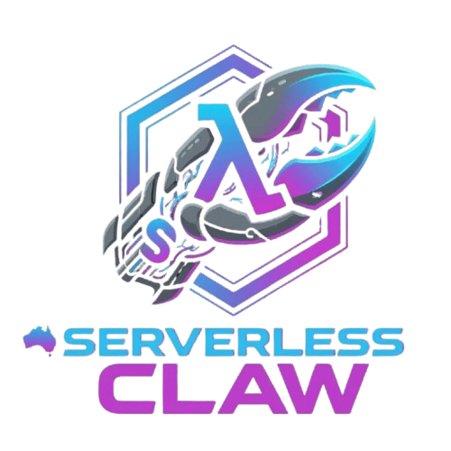

# Serverless Claw

<p align="center">
  
</p>

<p align="center">
  
  
  
  
  
  
  
</p>

<p align="center">
  <strong>The world's first fully autonomous, self-evolving, and serverless AI agent swarm.</strong>
</p>

---

### 🌟 Help us grow

A **Star** or **Fork** genuinely helps this project reach more developers. The agents didn't calculate that — we just asked nicely.

---

**Serverless Claw** is a **cutting-edge, event-driven, and AI-native** implementation of the **OpenClaw** platform, currently in its **evolving** early-access phase. It features an orchestrated swarm of agents that can write code, modify their own AWS infrastructure, and deploy updates on the fly—all with **Zero Idle Costs**.


## 🆚 The 2026 "Claw" Comparison

| Feature | **OpenClaw** | **NanoClaw** | **ZeroClaw** | **Serverless Claw (Us)** |
| :--- | :--- | :--- | :--- | :--- |
| *Infrastructure* | | | | |
| **Architecture** | Monolithic Node.js | Micro TypeScript | Native Rust Binary | **Event-Driven Serverless (Lambda)** |
| **Operational Cost** | High (24/7 Server) | Moderate (VPS/Docker) | Low (Raspberry Pi) | **Zero Idle Cost ($0 when not in use)** |
| **Scalability** | Manual Cluster | Docker Swarm | Hardware-bound | **Elastic Auto-scale (AWS Native)** |
| *Agent Runtime* | | | | |
| **Multi-Agent** | Basic "Fire & Forget" | Containerized Swarms | Trait-based Modular | **Non-blocking (Pause & Resume)** |
| **Self-Evolution** | Plugin-based (Static) | Manual (Human-coded) | Hardware-focused | **Verified Refactor → Planner Loop** |
| **Skill Acquisition** | Static (Hardcoded) | Static (Hardcoded) | Static (Config-based) | **Just-in-Time (JIT) Skill Discovery** |
| *Tooling & Integration* | | | | |
| **Tooling Architecture** | Static Registry | Static (JSON) | Static (Hardcoded) | **Hub-First Dynamic Discovery** |
| **MCP Integration** | Not Supported | Local Stdio Only | Low-level C FFI | **SSE/Stdio Hybrid (Hub-First)** |
| **Vision Capability** | OCR / Text-only | Basic Base64 | Edge Inference | **S3-mediated Multi-modal Pipeline** |
| *Memory* | | | | |
| **Memory Model** | SQLite / Local File | Volatile Cache | Flash Storage | **Tiered Memory Engine + Hit Tracking** |
| **Collaborative Memory** | None (Log-based) | Minimal (JSON) | None | **ClawCenter Neural Reserve Hub** |
| *Reliability & Ops* | | | | |
| **Observability** | Standard Text Logs | Container Logs | Binary Logs | **Trace Graphs (`ClawTracer`)** |
| **Resilience** | Manual Recovery | Restart Container | Hardware Watchdog | **Autonomous Heartbeat + Rollback** |
| **Resource Safety** | App-level Permissions | Sandboxing (Docker) | Memory Safe (Rust) | **Cloud IAM + Recursion Guards** |

## 🚀 Key Innovations

1. **[Ask-Back Clarification Protocol](./docs/AGENTS.md#clarification-protocol)**: Sub-agents stop and ask for info via AgentBus rather than guessing.
2. **[Tiered Neural Memory](./docs/MEMORY.md)**: DynamoDB-backed memory system with hit-tracking and automatic 2-year retention.
3. **[Self-Aware Topology](./ARCHITECTURE.md#infrastructure-discovery)**: Real-time discovery of agent-tool linkages for 100% accurate system visualization.
4. **[Hub-First MCP (JIT Skills)](./docs/TOOLS.md#mcp-skills-external--hybrid)**: Prioritizes external skill hubs with graceful local fallback for infinite tool scaling.
5. **[Dead Man's Switch (DMS)](./docs/SAFETY.md#dead-mans-switch)**: 15-minute heartbeat probe that triggers automated rollbacks on system failure.
6. **[Multi-Modal Vision](./ARCHITECTURE.md#multi-modal-storage-flow)**: Bridge Telegram media to S3 for agent-led PDF analysis and image comprehension.
7. **[AI-Native Codebase](./ARCHITECTURE.md#design-philosophy)**: Semantic transparency and strict neural typing optimized for 0.1s reasoning accuracy.

## 🏗️ Technical Blueprint

Serverless Claw follows an **AI-Native** design principle, prioritizing readability for both humans and LLMs. The backbone is powered by the **AgentBus (AWS EventBridge)**, enabling non-blocking, asynchronous coordination across specialized personas like the **Strategic Planner**, **Coder**, and **QA Auditor**.

For a deep dive into the system topology and data flow, see **[ARCHITECTURE.md](./ARCHITECTURE.md)**.

## ⚡ Quick Start

```bash
# 1. Install dependencies
pnpm install

# 2. Configure AWS Secrets
# Populate .env with SST_SECRET_ prefixes (e.g. SST_SECRET_OpenAIApiKey)

# 3. Launch Development Mode
make dev
```

## 📖 Documentation Hub

Start with **[INDEX.md](./INDEX.md)** — the progressive context loading map for both humans and agents.

| Doc | Purpose |
|-----|---------|
| [INDEX.md](./INDEX.md) | **Hub** — Start here for the documentation map |
| [ARCHITECTURE.md](./ARCHITECTURE.md) | System topology & **AI-Native Principles** |
| [docs/AGENTS.md](./docs/AGENTS.md) | Agent roster & Evolutionary loop |
| [docs/MEMORY.md](./docs/MEMORY.md) | Tiered memory engine & co-management |
| [docs/TOOLS.md](./docs/TOOLS.md) | Full tool registry & **MCP Standards** |
| [docs/SAFETY.md](./docs/SAFETY.md) | Circuit breakers & DMS Rollback |
| [docs/DEVOPS.md](./docs/DEVOPS.md) | DevOps Hub, make targets, & CI/CD |
| [docs/ROADMAP.md](./docs/ROADMAP.md) | Planned features & Strategic goals |

## 📜 License

MIT
# test
