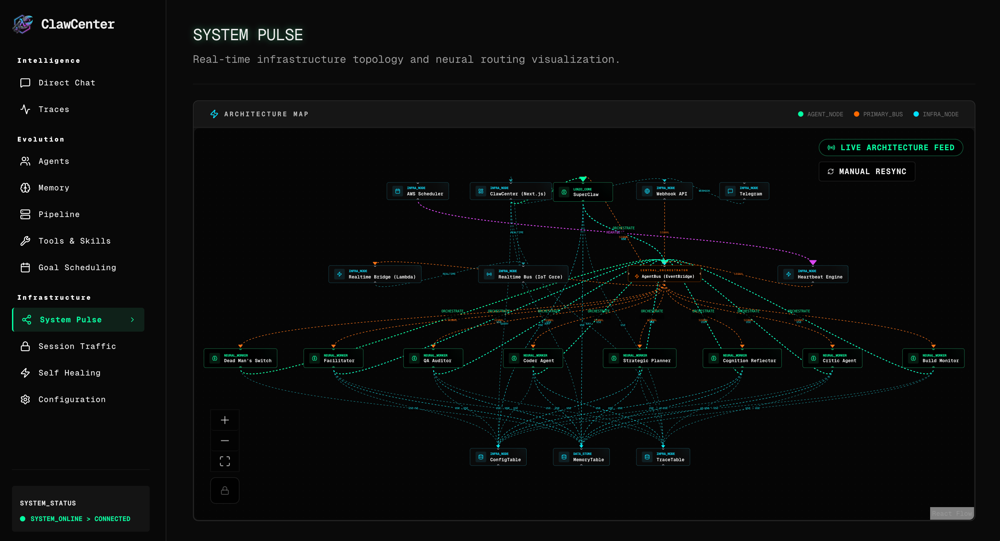

# Serverless Claw

<p align="center">
  
</p>

<p align="center">
  
  
  
  
</p>

<p align="center">
  <strong>Self-evolving AI agents on AWS. $0 when idle.</strong>
</p>

<p align="center">
  Agents that write code, test it, and deploy themselves — serverless, zero-trust, and autonomous.
</p>

---

## Why Serverless Claw?

**$0 when idle.** Lambda scales to zero. No VPS, no Docker daemon, no 24/7 server. Your agent swarm costs nothing until you send it a message.

**Self-evolving, not just executing.** Agents don't just run tasks — they write code, run tests, push to Git, and redeploy the entire stack. A verified lifecycle with QA gating ensures safe evolution.

**Serverless = secure by default.** No SSH keys exposed. No always-on daemon with shell access. IAM policies enforce least-privilege. No ClawHub supply chain attacks.



## How It Works

```
You (Telegram / Discord)
  └──▶ SuperClaw (Lambda) ──▶ AgentBus (EventBridge)
         │                        │
         │                   Coder Agent ──▶ Deployer (CodeBuild)
         │                        │
         └──▶ ClawCenter Dashboard ◀── IoT Core (real-time)
```

When you send a message, **SuperClaw** (running on Lambda) receives it, plans with the **Strategic Planner**, dispatches work to specialized agents via **EventBridge**, and streams results to **ClawCenter** in real-time. Agents can modify their own code, run tests, and trigger a new deployment — all autonomously.

## Architecture at a Glance

| What                    | How                                                                         |
| ----------------------- | --------------------------------------------------------------------------- |
| **7 Autonomous Agents** | SuperClaw, Coder, Worker, Strategic Planner, Reflector, QA Auditor, Critic  |
| **Self-Evolution**      | Verified refactor → planner loop with QA gating and HITL approval           |
| **Memory**              | Tiered engine with hit-tracking, neural pruning, human co-management        |
| **Safety**              | Circuit breakers, Dead Man's Switch (15-min heartbeat), IAM least-privilege |
| **Observability**       | ClawTracer trace graphs, real-time dashboard, structured signals            |
| **Multi-Model**         | OpenAI, AWS Bedrock, Gemini, MiniMax — dynamic routing                      |

For a full deep-dive into system topology and data flow, see **[ARCHITECTURE.md](./ARCHITECTURE.md)**.

## Quick Start

**Prerequisites:** AWS account, Node.js 24+, pnpm 10+

**Estimated cost:** ~$0.50–$5/month for light use (Lambda free tier covers most idle time)

### 1. Clone & Install

```bash
git clone https://github.com/caopengau/serverlessclaw.git
cd serverlessclaw && pnpm install
```

### 2. Configure Secrets

```bash
cp .env.example .env
# Edit .env — you need at minimum:
#   SST_SECRET_OpenAIApiKey (or use Bedrock/Gemini)
#   SST_SECRET_TelegramBotToken (or Discord webhook)
```

### 3. Deploy

```bash
make dev    # Local development (stage: local)
make deploy # Deploy to AWS (stage: dev)
```

## Documentation Hub

Start with **[INDEX.md](./INDEX.md)** — the progressive context loading map for both humans and agents.

| Doc                                  | Purpose                                        |
| ------------------------------------ | ---------------------------------------------- |
| [INDEX.md](./INDEX.md)               | **Hub** — Start here for the documentation map |
| [ARCHITECTURE.md](./ARCHITECTURE.md) | System topology & **AI-Native Principles**     |
| [docs/AGENTS.md](./docs/AGENTS.md)   | Agent roster & Evolutionary loop               |
| [docs/MEMORY.md](./docs/MEMORY.md)   | Tiered memory engine & co-management           |
| [docs/TOOLS.md](./docs/TOOLS.md)     | Full tool registry & **MCP Standards**         |
| [docs/SAFETY.md](./docs/SAFETY.md)   | Circuit breakers & DMS Rollback                |
| [docs/DEVOPS.md](./docs/DEVOPS.md)   | DevOps Hub, make targets, & CI/CD              |
| [docs/ROADMAP.md](./docs/ROADMAP.md) | Planned features & Strategic goals             |

## 🆚 The 2026 "Claw" Comparison

| Feature                  | **OpenClaw**          | **NanoClaw**          | **ZeroClaw**          | **Serverless Claw (Us)**                 |
| :----------------------- | :-------------------- | :-------------------- | :-------------------- | :--------------------------------------- |
| _Infrastructure_         |                       |                       |                       |                                          |
| **Architecture**         | Monolithic Node.js    | Micro TypeScript      | Native Rust Binary    | **Event-Driven Serverless (Lambda)**     |
| **Operational Cost**     | High (24/7 Server)    | Moderate (VPS/Docker) | Low (Raspberry Pi)    | **Zero Idle Cost ($0 when not in use)**  |
| **Scalability**          | Manual Cluster        | Docker Swarm          | Hardware-bound        | **Elastic Auto-scale (AWS Native)**      |
| _Agent Runtime_          |                       |                       |                       |                                          |
| **Multi-Agent**          | Basic "Fire & Forget" | Containerized Swarms  | Trait-based Modular   | **Non-blocking (Pause & Resume)**        |
| **Self-Evolution**       | Plugin-based (Static) | Manual (Human-coded)  | Hardware-focused      | **Verified Refactor → Planner Loop**     |
| **Communication Mode**   | Natural Language      | Structured (JSON)     | Low-level Buffers     | **Dual-Mode (Intent-Based JSON + Text)** |
| **Skill Acquisition**    | Static (Hardcoded)    | Static (Hardcoded)    | Static (Config-based) | **Just-in-Time (JIT) Skill Discovery**   |
| _Tooling & Integration_  |                       |                       |                       |                                          |
| **Tooling Architecture** | Static Registry       | Static (JSON)         | Static (Hardcoded)    | **Hub-First Dynamic Discovery**          |
| **MCP Integration**      | Not Supported         | Local Stdio Only      | Low-level C FFI       | **SSE/Stdio Hybrid (Hub-First)**         |
| **Vision Capability**    | OCR / Text-only       | Basic Base64          | Edge Inference        | **S3-mediated Multi-modal Pipeline**     |
| _Memory_                 |                       |                       |                       |                                          |
| **Memory Model**         | SQLite / Local File   | Volatile Cache        | Flash Storage         | **Tiered Memory Engine + Hit Tracking**  |
| **Collaborative Memory** | None (Log-based)      | Minimal (JSON)        | None                  | **ClawCenter Neural Reserve Hub**        |
| _Reliability & Ops_      |                       |                       |                       |                                          |
| **Observability**        | Standard Text Logs    | Container Logs        | Binary Logs           | **Trace Graphs (`ClawTracer`)**          |
| **Resilience**           | Manual Recovery       | Restart Container     | Hardware Watchdog     | **Autonomous Heartbeat + Rollback**      |
| **Resource Safety**      | App-level Permissions | Sandboxing (Docker)   | Memory Safe (Rust)    | **Cloud IAM + Recursion Guards**         |

## Tech Stack

<p>
  
  
  
  
  
  
  
  
</p>

## Contributing

See [CONTRIBUTING.md](./docs/CONTRIBUTING.md). We welcome issues, PRs, and ideas.

## License

MIT
