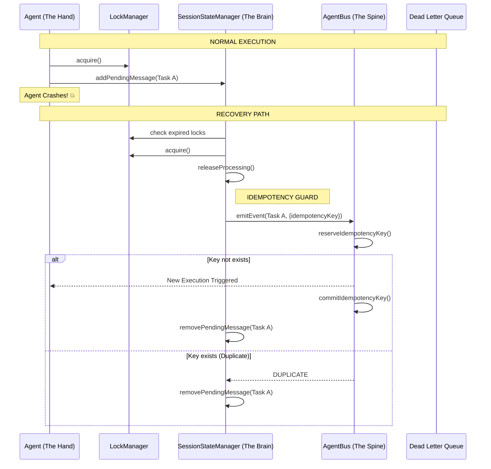

# Recovery Path Architecture

This document describes the idempotent recovery mechanisms used in Serverless Claw to ensure "Exactly-once" or "Idempotent At-least-once" semantics during system failures.

## Recovery Flow Diagram



## DLQ Retry Flow (Spine Resilience)

````mermaid
graph TD
    A[DLQ Entry] --> B{retryDlqEntry}
    B --> C[emitEvent with IdempotencyKey]
    C --> D{reserveIdempotencyKey}
    D -- New --> E[Commit & Emit]
    E --> F[Purge DLQ Entry]
    D -- Duplicate --> F
    C -- Failure --> G[Wait for next retry]

## Proactive Evolution Recovery (Safety Guard)

For Class C actions that require human approval, the `EvolutionScheduler` monitors for timeouts and triggers "Proactive Evolution" (Strategic Tie-Breaking). This path uses deterministic idempotency keys to ensure that a timed-out action is only triggered once across the system.

```mermaid
sequenceDiagram
    participant Scheduler as EvolutionScheduler
    participant DDB as DynamoDB (MemoryTable)
    participant Bus as AgentBus

    Scheduler->>DDB: triggerTimedOutActions(workspaceId)
    DDB-->>Scheduler: List of pending (status=pending, expiresAt <= now)
    loop For each action
        Scheduler->>DDB: claimActionForTrigger(actionId) [Atomic Update]
        alt Status was 'pending'
            DDB-->>Scheduler: SUCCESS (status set to 'triggered')
            Scheduler->>Bus: emitTypedEvent(EventType.STRATEGIC_TIE_BREAK, {idempotencyKey})
            Note over Scheduler,Bus: key = eve-trigger:{actionId}
            Bus-->>Scheduler: EMMITED
        else Status already 'triggered'/'approved'
            DDB-->>Scheduler: ConditionalCheckFailed
            Note right of Scheduler: SKIP (already handled)
        end
    end
````

````

## Atomic Multi-Tenant DLQ Retrieval

To prevent "In-Memory Multi-Tenant Filtering" (Anti-Pattern 19), the system utilizes server-side `FilterExpression` for DLQ retrieval. This ensures that even if a GSI is shared across tenants, data is filtered at the database layer before being returned to the application.

```ascii
[ Request DLQ ] --(workspaceId)--> [ DynamoDB ]
                                       |
                                       |-- Index: TypeTimestampIndex
                                       |-- FilterExpression: workspaceId = :ws
                                       |
                                   [ ISOLATED DATA ]
````

## Key Mechanisms

1.  **Deterministic Idempotency Keys**: Derived from unique message IDs (`resume:sessionId:msgId`) to ensure that even if metadata cleanup fails, the side effect (event emission) is only processed once.
2.  **Emit-then-Purge Strategy**: In the DLQ retry path, the event is emitted _before_ the DLQ entry is purged. Idempotency guards prevent duplicates, and the purge only happens upon confirmed success or confirmed duplication.
3.  **Fail-Closed Circuit Breakers**: Distributed state checks (`isCircuitOpen`, `consumeToken`) default to "Closed" (rejected) on system failures to prevent cascading instability.
4.  **Monotonic DLQ Filtering**: Ensures that background recovery tasks never cross-contaminate tenant recovery queues.
